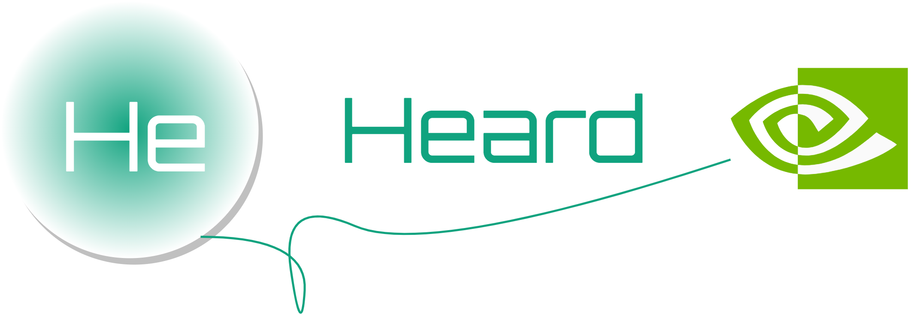
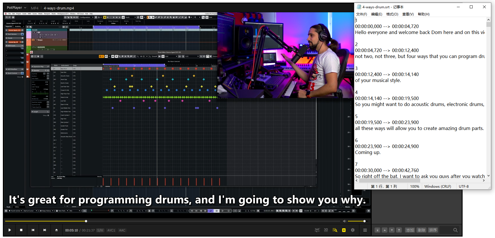

<p align="center">
    
</p>

<div align="center">

[](https://github.com/rerender2021/heard/actions/workflows/build.yml) [](https://github.com/rerender2021/heard/actions/workflows/pack.yml)

 </div>
 
# 简介

听到了! (Heard) 是一个字幕生成器，原理：

-   使用 [Whisper](https://github.com/openai/whisper) 生成字幕，支持 GPU 模式
-   GUI 部分则是使用 [Ave React](https://qber-soft.github.io/Ave-React-Docs/) 开发的


使用它可以生成 srt 格式字幕：



<!-- 演示视频见:

-   [回声：实时英语语音翻译](https://www.bilibili.com/video/BV11L411d7HE/) -->

# 使用说明

-   软件首页：https://rerender2021.github.io/products/heard/

# 开发者向

## 本地开发

```bash
> npm install
> npm run dev
```

开发过程中需要确保本机启动了 Whisper 服务器: https://github.com/rerender2021/Whisper-API/releases/tag/1.0.0

下载它，并解压到项目下，确保项目目录结构如下：

```
- whisper-gpu-server
    - Whisper-API.exe
    - ...
- src
- ...
- package.json
```

- 此外，还需要安装 cuda 环境，注意版本：11.7：https://developer.nvidia.com/cuda-11-7-0-download-archive?target_os=Windows&target_arch=x86_64

验证 cuda 安装成功：命令行输入 `nvcc -V`，看输出：

```bash
  Copyright (c) 2005-2022 NVIDIA Corporation
  Built on Tue_May__3_19:00:59_Pacific_Daylight_Time_2022
  Cuda compilation tools, release 11.7, V11.7.64
  Build cuda_11.7.r11.7/compiler.31294372_0
```

- 运行 Whisper 还需要安装 ffmpeg，验证是否安装成功：`ffmpeg -v`

```bash
ffmpeg version 2022-02-10-git-b6bb6b9f22-full_build-www.gyan.dev Copyright (c) 2000-2022 the FFmpeg developers
  built with gcc 11.2.0 (Rev7, Built by MSYS2 project)
  ...
```

## 功能扩展

默认支持 Whisper 类型为 base 的模型（英语 & 多语言），如果需要使用其它模型，可自行下载，并放在 `whisper-gpu-server\model` 下。

-   模型下载地址：https://github.com/openai/whisper/discussions/63#discussioncomment-3798552

## 打包发布

-   生成 exe

```bash
> npm run release
```

# 开源协议

[MIT](./LICENSE)

# 赞赏

`:)` 如果此软件值得赞赏，可以请作者看小说，一元足足可看八章呢。

<p align="left">
    
</p>
